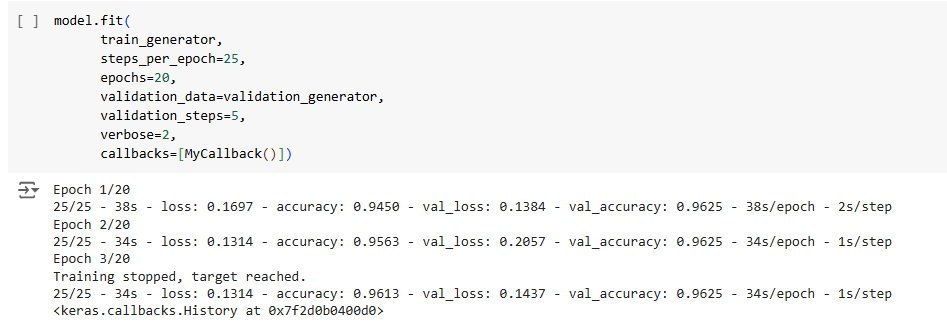
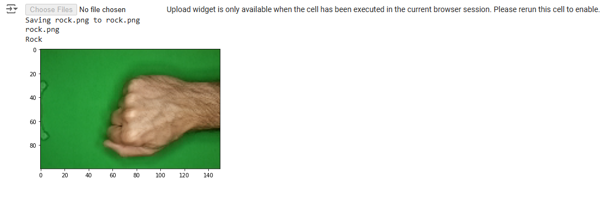

<h1 align="center">
Image Classification_ a program that is able to recognize the shape of a hand that forms scissors, rock, or paper from an image
</h1>

Program jaringan saraf tiruan menggunakan TensorFlow, Program mampu mengenali bentuk tangan yang membentuk gunting, batu, atau kertas.

<h2 align="center">
Preview Program
</h2>

  
  

  <!-- 
   -->

<h2 align="center">
Presented By
</h2>
<h3 align="center">Rafi Rachmad Ramadhan</h3>
 
